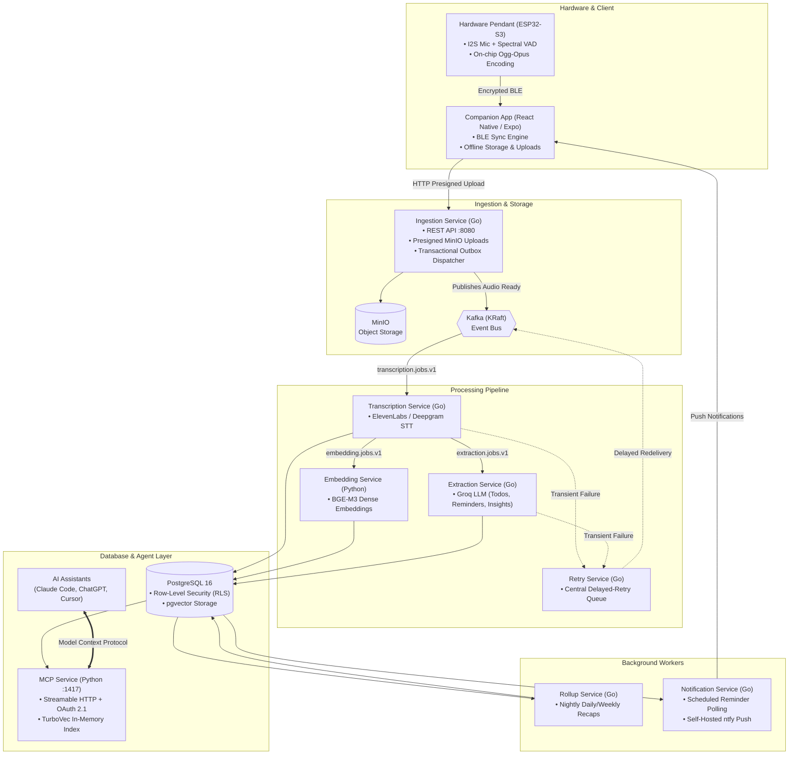

# Checkpoint


> Open-source, local-first AI wearable pendant and personal intelligence stack.

Checkpoint is an end-to-end system that captures ambient voice notes, compresses audio on-chip, syncs to your mobile device, extracts structured intelligence (action items, reminders, insights), and exposes your memory to AI agents (Claude, ChatGPT, Cursor) via the Model Context Protocol (MCP).

---

## What is Checkpoint?

Checkpoint bridges physical ambient audio capture with personal AI assistants while keeping your data private and self-hostable.

- **Wearable Hardware:** A low-power ESP32-S3 pendant that records voice notes with on-chip Voice Activity Detection (VAD) and hardware Ogg-Opus compression.
- **Local-First Sync:** Audio syncs directly from the pendant to your phone over encrypted Bluetooth Low Energy (BLE).
- **Event-Driven Backend:** A microservices pipeline powered by Go, Python, Kafka, and PostgreSQL (`pgvector`) that transcribes audio, extracts structured tasks, and builds semantic memory.
- **Agent-Ready (MCP):** A Model Context Protocol server that lets external AI assistants query your day, search conversations, and manage tasks.

---

## How It Works (End-to-End Architecture)



---

## Services & How They Connect

### 1. Hardware & Firmware (`firmware/checkpoint/`)
* **Role:** Dedicated pendant running on an ESP32-S3 microcontroller.
* **How it connects:** Samples audio via an I2S digital microphone, runs real-time spectral Voice Activity Detection (VAD) to filter background noise, encodes speech directly into Ogg-Opus (16 kbps) on-chip, and streams packets over an encrypted, window-acknowledged BLE connection to the mobile app.

### 2. Companion Mobile App (`checkpoint-app/`)
* **Role:** Cross-platform mobile client (React Native / Expo).
* **How it connects:** Establishes an authenticated BLE connection to the pendant, syncs audio chunks locally, and uploads them to the **Ingestion Service** via presigned URLs. Also receives background reminder notifications from **Notification Service**.

### 3. Ingestion Service (`ingestion-service/`)
* **Role:** Central HTTP API (`:8080`) and storage orchestrator.
* **How it connects:** Validates user identity via Ory Kratos, issues presigned upload URLs for **MinIO**, verifies uploaded audio chunks, and registers uploads in PostgreSQL with Row-Level Security (RLS). A transactional outbox dispatcher publishes `transcription.jobs.v1` events to **Kafka**.

### 4. Transcription Service (`transcription-service/`)
* **Role:** Asynchronous speech-to-text worker.
* **How it connects:** Consumes `transcription.jobs.v1` from **Kafka**, streams audio from **MinIO**, invokes transcription providers (ElevenLabs / Deepgram), writes the completed transcript into PostgreSQL, and emits events to trigger downstream **Embedding** and **Extraction** services.

### 5. Extraction Service (`extraction-service/`)
* **Role:** Structured intelligence extractor.
* **How it connects:** Consumes `extraction.jobs.v1` from **Kafka**, batches transcripts per user in PostgreSQL, and prompts Groq LLMs to extract actionable tasks, time-sensitive reminders, and personal insights in a single pass.

### 6. Embedding Service (`embedding-service/`)
* **Role:** Semantic vectorizer.
* **How it connects:** Consumes `embedding.jobs.v1` from **Kafka**, partitions transcripts into semantic chunks, generates dense vector representations using `bge-m3`, and writes vectors to PostgreSQL (`pgvector`).

### 7. Retry Service (`retry-service/`)
* **Role:** Centralized backoff and retry manager.
* **How it connects:** Subscribes to retry queues from **Transcription** and **Extraction**. Stores failed jobs in PostgreSQL with exponential backoff timers, re-emitting messages to their source Kafka topics when ready.

### 8. Rollup Service (`rollup-service/`)
* **Role:** Nightly memory summarizer.
* **How it connects:** Polls PostgreSQL during local user night hours to collect that day’s transcripts and extracted items, invoking LLM summaries to build cohesive daily and weekly narrative summaries.

### 9. Notification Service (`notification-service/`)
* **Role:** Push notification scheduler.
* **How it connects:** Polls PostgreSQL for due reminder records created by the **Extraction Service** and delivers push alerts to user topics using a self-hosted `ntfy` server.

### 10. MCP Service (`mcp-service/`)
* **Role:** Model Context Protocol retrieval server (`:1417`).
* **How it connects:** Builds a derived search index (`search_documents`) combining transcripts, embeddings, reminders, and summaries into an in-process TurboVec vector index. Exposes tools (`search`, `timeline`, `list_todos`, `list_reminders`, `get_summaries`, `get_transcript`) over Streamable HTTP with OAuth 2.1 authentication for Claude, ChatGPT, and Cursor.

### 11. Admin Console (`admin-console/`)
* **Role:** Local web developer interface (Angular 21 + Fastify).
* **How it connects:** Runs locally (`:4300`) to interface with USB serial tools (`arduino-cli`), allowing builders to flash firmware, read hardware claim keys, and register pendant devices with the backend database.

---

## Infrastructure Overview

All backend services run as isolated containers coordinated by Docker Compose:

* **PostgreSQL 16:** Relational data store with `pgvector` for vector similarity and Row-Level Security (RLS) separating user data.
* **Kafka (KRaft):** High-throughput, distributed event bus coordinating async pipelines without ZooKeeper.
* **MinIO:** S3-compatible local object storage for raw audio assets.
* **Ory Kratos:** Lightweight, self-hosted user authentication and identity management.
* **ntfy:** Low-latency, privacy-friendly push notification server.

---

## Quickstart (Local Backend)

### 1. Configure Environment
```bash
# Windows
copy .env.example .env

# Linux / macOS
cp .env.example .env
```
Add your provider API keys (e.g. `GROQ_API_KEY`, `ELEVENLABS_API_KEY` or `DEEPGRAM_API_KEY`) to `.env`.

### 2. Start the Stack
```bash
docker compose up -d --build
```

### 3. Verify Health
```bash
curl http://localhost:8080/health/ready
```

For detailed setup of the pendant hardware and mobile application, refer to [`docs/DEVELOPER_SETUP.md`](docs/DEVELOPER_SETUP.md).

---

## Contributing

We welcome contributions across hardware design, firmware, mobile, backend services, and documentation! Please check out [`CONTRIBUTING.md`](CONTRIBUTING.md) for our setup guide, testing commands, and PR workflow.
